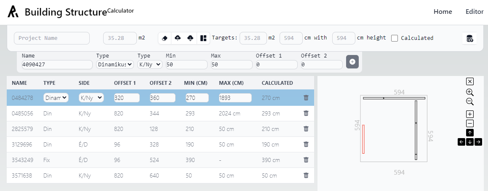
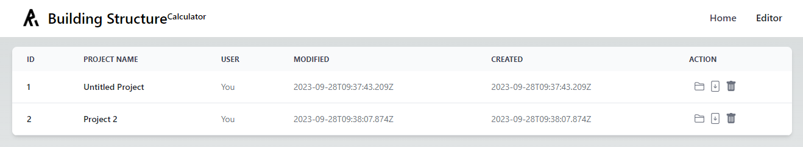

# Building Structure Calculator



This application also incorporates the design of the base plan of walls and performs the necessary calculations related to it. 
The project uses [Next.js](https://nextjs.org/) with [Typescript](https://www.typescriptlang.org/).

## Features

- Add new items with specified attributes.
- Dynamic UI updates based on dropdown selections.
- Synchronized numeric inputs based on specific conditions.
- SVG based representation of schematics

## Getting Started

First, run the development server:

```bash
npm run dev
# or
yarn dev
# or
pnpm dev
```

Open [http://localhost:3000](http://localhost:3000) with your browser to see the main dashboard:



You can edit, download and delete old project or you can create one from scratch by opening **Editor** menu on the top. bar.


## Deploy on Vercel

The easiest way to deploy your Next.js app is to use the [Vercel Platform](https://vercel.com/new?utm_medium=default-template&filter=next.js&utm_source=create-next-app&utm_campaign=create-next-app-readme) from the creators of Next.js.

Check out our [Next.js deployment documentation](https://nextjs.org/docs/deployment) for more details.

## Contributing

If you'd like to contribute, please fork the repository and use a feature branch. Pull requests are warmly welcome.
